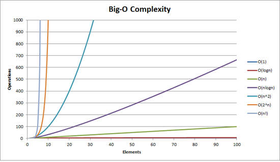

# Funciones

## Introducción

Una función es un "subprograma" que puede ser *llamado* por codigo. Esta compuesto por una secuencia de enunciados que realizan una tarea o calculan un valor.

Las funciones en JavaScript son identificadas como objetos de primer-nivel, ya que pueden tener propiedades como cualquier objeto, y pueden ser pasadas como argumentos a otras funciones. La única diferencia entre una función y un objeto en JavaScript, es que la función puede ser invocada (*called* o *invoked*).

En esencia, una función es un proceso que toma entradas, llamadas argumentos, y produce algún tipo de salida, conocido como "valor de retorno". Las funciones pueden ser creadas para cumplir con los siguientes propositos:

- Mapeos: producir determinados valores a partir de las entradas. Una función puede  *mapear* valores a la entrada con valores a la salida.
- Procedimientos: una función puede ser llamada para realizar una serie de pasos. Esta secuencia es conocida como procedimiento (*procedure*).
- I/O: algunas funciones existen para la comunicación con otras partes del sistema, como: la pantalla, el filesystem, la red, etc.

### Definición

Todas las funciones en JavaScript son objetos de tipo `Function`, sin importar como haya sido declarada la función. 

Antes de poder llamar a una función debemos definirla. Para esto utilizamos la palabra clave `function`. La expresión `function` produce una instancia del objeto función.

```javascript
function miFuncion (arg1, arg2, arg3){
    // Cuerpo de la función.
}
```

Las funciones en JavaScript son objetos de primer nivel. Esto quiere decir que las funciones pueden:

- Ser pasadas como argumentos a otras funciones.
- Ser retornadas por una otra función.
- Ser asignadas a una variable.
- Ser almacenadas en un objeto o `array`.

En el ejemplo anterior creamos la función `miFuncion` la cual consume tres argumentos: `arg1, arg2, y arg3`. Los argumentos en las funciones son opcionales, tanto en la declaración, como al momento de su invocación. El nombre de la función también es opcional. Cuando las funciones no tienen asociado un nombre, se reconocen como *funciones anonimas*. Las funciones anonimas tienen que ser asociadas a una variable para poder ser invocadas, o pueden definirse dentro de un objeto.

```javascript
var miFuncion = function () {};

var miObjeto = {
    miFuncion: function () {}
};
```

Las funciones asociadas a variables son también conocidas como *function expressions*.

Una propiedad fundamental de JavaScript, es la capacidad de definir funciones dentro de otra función. La utilidad de esta capacidad no es evidente, pero permite la construcción de ciertos patrones muy potentes.

```javascript
function foo() {
    function bar() {}
}
```

La función `bar` definida dentro de `foo` solamente puede ser utilizada dentro de la misma. A continuación veremos como invocar estas funciones.

#### Ejercicios

Construya 3 funciones utilizando los metodos definidos anteriormente:

- Declaración de una función (`Function declaration`).
- Función como enunciado (`Function statement`).
- Función dentro de un objeto.

Nota: las funciones creadas no tienen porque hacer nada en particular.

### Invocación

La definición de una función no es suficiente para correr los procedimientos almacenados en la misma. Para esto tenemos que invocarla.

Para invocar una función utilizamos su nombre, o la variable asociada, seguida por los argumentos entre paréntesis `()`.

```javascript
function foo () {
    // Cuerpo de función `foo`.
}
var bar = function() {
    // Cuerpo de funcion `bar`
};
// Invocación de función `foo`.
foo();
// Invocación de función `bar`.
bar(1, 'Hola', [1, 2, 3], {llave: 'valor'});

```

En el ejemplo anterior se puede ver que indpendientemente de como se haya declarado la función, se llaman de la misma manera. Un punto importante a observar, es en la invocación de la función `bar`. Si repasamos la definición de esta función, vemos que no se declaro níngun argumento. Sin embargo, en JavaScript es completamente valido llamar a una función pasandole argumentos que no fueron definidos al momento de crear la función. Veremos más adelante como una función en JavaScript puede acceder a estos argumentos no definidos utilizando el objeto `arguments`.

Si la función fue definida dentro de un objeto, la llamamos exactamente igual que en el ejemplo anterior. Simplemente recorremos el objeto hasta llegar a la llave que contiene la referencia a nuesta función, independientemente de que tan profundo se encuentre dentro del objeto.

```javascript
var foo = {
    bar: function () {}
};
// Invocación de función `bar` dentro del objeto `foo`.
foo.bar();
// Agregamos una nueva llave al objeto `foo`.
foo.baz = {};
// Definimos una nueva función dentro del objeto `foo.baz`.
foo.baz.miFuncion = function(){};
// Llamamos a la función `miFuncion` dentro del objeto 
// `foo.baz`.
foo.baz.miFuncion();
```

Esta propiedad de los objetos, es lo que hace que ellos sean el bloque principal para crear aplicaciones en JavaScript. Ya que un objeto, puede contener no solo valores, sino funciones para interactuar con su información.

#### Ejercicios

Crear 3 funciones de distintas maneras, que impriman algo en la consola. Luego llamen cada una de ellas y verifiquen que se comportan como esperan.

### Retorno

Todas las funciones devuelven un valor. Por defecto este valor es `undefined`, a excepción de las funciones constructoras que devuelven el objeto `this` utilizado dentro de la misma. Veremos más adelante la definición de una función constructora y que es el objeto `this`.

```javascript
function foo () {}
foo();
// >>> undefined
```

En algunas consolas puede que no se vea impreso el valor `undefined`, pero eso es por la implementación de la consola de JavaScript utilizada, no de el lenguaje en si.

El valor retornado puede ser especificado utilizando la palabra clave `return`, seguido del valor a devolver. Toda función puede devolver solamente un valor, sin excepción. Si necesitamos devolver más de un valor, debemos hacerlo dentro de un objeto o un array.

```javascript
function foo (arg) {
    return arg;
}
function baz (arg1, arg2) {
    return {
        out1: arg1,
      	out2: arg2,
    };
}
foo(1);
// >>> 1
baz(1, 2);
// >>> { out1: 1, out2: 2 }
```

#### Ejercicios

1. Crear una función que sume dos argumentos y devuelva el resultado.
2. Crear una función que tome al menos 3 argumentos y los devuelva dentro de una lista.
3. Crear una función que tome al menos 3 argumentos y los devuelva dentro de un objeto.
4. Crear una cuarta función que tome al menos 3 argumentos y devuelva una función, que al ser llamada, imprima los argumentos en la consola. 

### `this`

Más adelante vamos a volver a repasar el objeto `this` más en profundidad, haciendo énfasis en cuando es conveniente utilizarlo, y cuando es mejor no. Por ahora, vamos a decir simplemente que es un objeto inicializado por el motor de JavaScript al momento de correr las funciones que:

- Contiene una referencia al objeto responsable de la invocación.
- Permite a una función saber con objeto debe tratar.
- Es una de las llaves para entender el concepto de `prototypal inheritance`.
- `this` es asignado al momento de la invocación.

### Side Effects

En progamación un *side effect*, o efecto secundario, es el nombre que se le da a una acción dentro del codigo, que modifica el estado de algo fuera de su contexto, o que tiene una interacción visible con el resto del mundo. Las funciones pueden interactuar de distinta manera con su entorno, y tenemos que entender claramente como es que lo hacen, para que no sucedan comportamientos indeseados dentro de nuestro código.

Por ejemplo, los argumentos son pasados a las funciones como valores. Esto quiere decir, que la modificación de estos valores, no tendra un impacto en el contexto exterior a la función. A menos que el valor del argumento corresponda a una referencia a un objeto. En este caso, una modificación en el mismo, producira cambios visibles en el exterior de la función.

```javascript
function foo (arg) {
	// El operador !! coherciona un valor a un booleano.
    return !!arg;
}
function bar(arg) {
    if (typeof arg === 'object') {
        arg.bar = 'Modificación de objeto'
    }
  	return !!arg;
}
var objeto = {};
foo(objeto);
// >>> true
console.log(objeto);
// >>> {}
bar(objeto);
// >>> true
console.log(objeto);
// >>> { bar: Modificación de objeto }
```

Ambas funciones definidas en el ejemplo anterior devuelven el mismo valor, con los mismos argumentos. La diferencia es que la segunda, modifica el argumento entregado, en caso de que este sea un objeto. En el ejemplo esta acción es evidente pero esto no siempre será así. Siempre que pasemos objetos como argumentos, debemos tener cuidado que solo realizaremos mutaciones sobre el mismo cuando nosotros lo queramos.

**OBS: El operador `typeof` devuelve el tipo correspondiente a una variable.**

En el ejemplo anterior realizamos lo que se conoce como una *mutación* a la variable pasada como argumento a la función `bar`. Esto es, una modificación de el valor almacenado en la variable (en este caso, `objeto`). Aplicar mutaciónes a nuestras variables es un procedimiento común cuando escribimos nuestros programas, y es una herramienta muy podera. Como tal, la mala utilización de la misma puede producir efectos indeseados en nuestro programa.

#### Ejercicios

Analice el siguiente script, e intente identificar el resultado de las llamadas a `console.log` realizadas al final.

```javascript
var a = 1;
var b = {c: 1, d: 2};
var e = 3;

function foo(g) {
	a = 2;
  	g.d = a + e;
}

foo(b);

console.log(a);
// >>> ¿?
console.log(b.c);
// >>> ¿?
console.log(b.d);
// >>> ¿?
console.log(e);
// >>> ¿?
```

**OBS: Intente resolver el ejercicio sin colocar este codigo en la consola.**

### Scope

El *scope* o *contexto* de un programa determina como y en donde una variable puede ser encontrada. Esta busqueda puede estar asociada al proceso de asignación de una variable o para acceder al valor almacenado dentro de la misma. 

Por defecto, todos los programas en JavaScript cuentan con al menos 1 contexto,  conocido como el contexto global (*global scope*). Dentro de este contexto global, se pueden crear otros contextos.

En JavaScript las funciones crean contextos, definidos sobre el contexto en el que fueron declarados. Siendo el primer nivel posible, el contexto global. Esto no es cierto de otros tipos de bloques del lenguaje como los bloques `if`, `for`, `switch`, etc. 

Cada contexto tiene acceso a las variables definidas dentro del mismo, y aquellas definidas en los contextos superiores donde esta contenida. Sin embargo, no puede acceder a las variables definidas en contextos interiores, o en otros contextos "hermanos".

Entender el concepto de como funcionan los contextos es fundamental para contruir algunos de los patrones más potentes del lenguaje, y para evitar algunos de los problemas más comunes.

Veamos con un ejemplo como podemos empezar a utilizar estos conceptos.

```javascript
// Inicio de contexto global.
var a = 1;
function foo() {
  	// Inicio de contexto de `foo`.
    var b = 2;
  	function bar() {
      	// Inicio de contexto de `bar`.
        var c = a;
      	return c;
      	// Fin de contexto de `bar`,
    }
  	return a + b + bar();
  	// Fin de contexto de `foo`.
}
foo();
// >>> 4
console.log(a);
// >>> 1
console.log(b);
// >>> Uncaught ReferenceError: b is not defined
console.log(c);
// >>> Uncaught ReferenceError: c is not defined
// Fin de contexto global.
```

En este ejemplo, se definieron 3 contextos:

1. Contexto global.
2. Contexto de `foo`.
3. Contexto de `bar`.

Dentro del contexto de `foo` podemos acceder a todas las variables del contexto global, pero no las del contexto de `bar`. Dentro del contexto de `bar` podemos acceder a las variables del contexto global y del contexto de `foo`. Podemos ver este funcionamiento cuando queremos imprimir en la consola los valores de `b` y `c`, y recibimos un mensaje de error indicando que el valor que estamos buscando no esta definido.

#### Ejercicios

Analice el siguiente script, e intente identificar el resultado de las llamadas a `console.log` realizadas al final.

```javascript
var a = 1;
var b = 2;
var c = 3;

function foo() {
	var b = 4;
  	
  	function bar(c) {
        return b + c;
    }
  
  	a = b;
  	
  	return a + b + bar(5)
}

b = foo();

console.log(a);
// >>> ¿?
console.log(b);
// >>> ¿?
console.log(c);
// >>> ¿?
```

**OBS: Intente resolver el ejercicio sin colocar este codigo en la consola.**

### IIFE

IIFE o "**Immediately Invokable Function Expression**" es el nombre que se le da a un patrón típico utilizado en JavaScript para crear funciones que se ejecutan una única vez, con el único objetivo de controlar el contexto en donde se corre el procedimiento contenido dentro de la función. El mismo esta compuesto por la definición de una *función anonima*, seguida de una invocación inmediata de la misma. Usualmente se coloca la definición de la función entre parentesis, simplemente por estetica.

```javascript
(function(){
    console.log('Logueando desde un IIFE');
})();
```

Este patrón es muy útil porque permite trabajar con variables sin temor a producir mutaciones en el contexto global. A medida que nuestras aplicaciones crescan en tamaño, la utilidad de este patrón será más evidente.

```javascript
var a = 1;
(function () {
	var a = 2;
  	console.log(a);
  	// >>> 2
})();
console.log(a);
// >>> 1
```

Vemos que podemos utilizar el mismo nombre de variables que las utilizadas en el contexto global.

Otra carateristica interesante de este patrón es que podemos ser explicitos en que variables consumira la función del contexto que la contiene, sin acceder directamente a ellas.

```javascript
var a = 1;
(function (entero) {
    console.log('entero =' + entero)
})(a);
```

En el ejemplo, en vez de acceder directamente a la variable `a` definida en el contexto global, le pasamos el valor de la misma a la función `IIFE` al momento de invocarla. Además de dejar de forma explicita la variable que estamos utilizadas dentro de la función, tenemos la posibilida de cambiar su nombre a algo que tenga más sentido dentro del contexto de la función. En el ejemplo, asociamos el valor de la variable `a` a una nueva variable llamada `entero` definida como un argumento de la funicón `IIFE`.

### Argumentos indefinidos

Anteriormente mencionamos que podemos utilizar el objeto `arguments` dentro de una función para acceder a los argumentos pasados al momento de que la función fue invocada, independientemente de si estos fuerón definidos al momento de crear la función.

El objeto `arguments` es aprovisionado por el motor de JavaScript de forma automatica cada vez que se llama a una función. Dentro del mismo podremos encontrar el valor de los argumentos pasados a la función como una pseudo-lista. Decimos que es una pseudo-lista porque tiene una estructura similar a una, pero carece de ciertas funciones fundamentales.

Podemos acceder a los argumentos ingresados como lo hacemos con cualquier otra lista, utilizando el indice correspondiente a la posición del argumento que queremos utilizar.

```javascript
function foo() {
    var arg1 = arguments[0];
  	var arg2 = arguments[1];
  	var arg3 = arguments[2];
  	console.log(arg1, arg2, arg3);
}
foo(1, 2, 3);
// >>> 1 2 3
```

Si llamamos a la función `foo` con menos de tres argumentos, aquellos no definidos tendrán su valor asignado a `undefined`.

Además de los argumentos almacenados como una lista dentro del objeto `arguments` podemos encontrar las siguientes variables:

- `arguments.calle`: La función que esta siendo actualmente ejecutada.
- `arguments.caller`: La función que invoco la función que esta siendo ejecutada.
- `arguments.length`: La cantidad de argumentos que fueron pasados a la función.

### Ejemplos

Pongamos en practica estos conceptos para familiarizarnos con ellos.

Comencemos por escribir alguna funciones que nos ayuden operar con números.

```javascript
function sum(a, b) {
    return a + b;
}

function mul(a, b) {
    return a * b;
}

sum(1, 2);
// >>> 3
mul(1, 2);
// >>> 2;
```

Ahora mejoremos estas funciones para que puedan tomar un número indiscriminado de números.

```javascript
function sum() {
    var accumulator = 0;
  	for (var i = 0; i < arguments.length; i ++){
        var argument = arguments[i];
      	accumulator += argument;
    }
  	return accumulator;
}

function mul() {
    var accumulator = 1;
  	for (var i = 0; i < arguments.length; i++) {
        var argument = arguments[i];
      	accumulator *= argument;
    }
  	return accumulator;
}

sum(1, 2, 3, 4);
// >>> 10
mul(1, 2, 3, 4);
// >>> 24
```

#### Ejericios

1. Intente crear aplicaciones similares para la resta y la divisón.

### Closures

Otra propiedad muy potente de las funciones en JavaScript es la capacidad de crear funciones que "construyan" otras funciones. A este tipo de funciones se las conoce con el nombre de "Higher Order Functions". Básicamente, son funciones que son llamadas igual que cualquier otra función, y regresan como resultado otra función.

Por ejemplo:

```javascript
function timesN (n) {
    return function (x) {
        return x * n;
    }
}

var times2 = timesN(2);
var times3 = timesN(3);

times2(5);
// >>> 10
times3(5);
// >>> 15
```

Un punto importante a resaltar es que la función retornada por `timesN` mantiene una referencia a la variable `n` durante toda su vida, y no hay forma de modificar su valor, ya que sol puede ser accedida dentro del scope de la función anonima retornada. No esta demás mencionar que esto es debido a que los argumentos se pasan a las funciones como valor, a menos que esto sean referencias a objetos. A esta propiedad de las funciones se le llama *Closures*. 

Los Closures son creados cuando las funciones o los objetos devueltos por una función deben seguir viviendo, una vez que las funciones "padre" que las crearon hayan terminado su operación. Utilizando closures podemos construir objetos dínamicos con múltiples propiedades y funciones.

```javascript
var Pet = {};

Pet.create = function (name) {
    var gender;
    return {
        setName: function (newName) {
			name = newName;
		},
      	getName: function () {
            return name;
        },
      	setGender: function (newGender) {
            if (typeof newGender === 'string' && (
              newGender.toLowerCase() === 'male' || 				
              newGender.toLowerCase() === 'female')
            ) {
        		gender = newGender;
      		}
        },
      	getGender: function () {
            return gender;
        },
      	toString: function () {
            return (
            	'Name: ' + name + '\n' +
              	'Gender: ' + gender + '\n'
            )
        }
    }
};

var dog = Pet.create('Maxx');
var cat = Pet.create('Sam');

dog.setGender('male');
cat.setGender('female');

console.log(dog.toString());
// >>> Name: Maxx
// >>> Gender: male
console.log(cat.toString());
// >>> Name: Sam
// >>> Gender: female

dog.setName('Max');
console.log(dog.toString());
// >>> Name: Max
// >>> Gender: male
```

Las variables interiores de esta función solo pueden ser accedidas por las funciones que se exponen en el objeto retornado por la función. La información almacenada en estas variables permanecen seguras durante la vida del objeto. 

Resumiendo:

- Las funciones internas solo pueden ser accedidas por funciones externas.
- Las funciones internas forman un *closure*: pueden usar argumentos y variables definidas en la función externa, mientras que la función exterior no puede usar las variables y argumentos de la función interna.

Un ejemplo más sencillo puede ayudar a clarificar esto.

```javascript
function sumaN(n) {
    return function (x) {
        return n + x;
    };
}

var suma2 = sumaN(2);
var suma3 = sumaN(3);

suma2(1);
// >>> 3
suma3(1);
// >>> 4

suma2(5) === sumaN(2)(5);
// >>> true
```

#### Ejercicios

1. Crear un objeto `Car`, que contenga solo una propiedad `create`, la cual puede ser llamada con un objeto con las siguientes propiedades: `brand` y `model`. Esta función deberá devolver un nuevo objeto con funciones para actualizar y leer las propiedades `brand` y `model`.
2. La función `sum` y la función `mul`, de ejemplos anteriores, son muy similares entre si, siendo la única diferencia la operación que realizan dentro del loop (`for`). Cree una nueva función que tome como argumento una operación, y devuelva una neva función que tome una cantidad indeterminada de argumentos, para aplicarle la operación a cada uno de ellos, y asi devolver el valor calculado o reducido.

```javascript
/**
  * Función que toma una operación y devuelve otra función capaz de
  * calcluar un valor acumulado de una cantidad indefinda de argumentos.
  * @param {function} operation Operación a aplicar sobre cada argumento.
  * @returns {function}
  */
function reducer(operation) {
    // Cuerpo de la función.
}

var sum = reducer(function(acc, x) {return acc + x});
var mul = reducer(function(acc, x) {return acc * x});

sum(2, 3, 4);
// >>> 10
mul(2, 3, 4);
// >>> 24
```

**OBS: Estas funciones y muchas más ya están incorporadas en el lenguaje a través del objeto global `Math`.**

<details>

<summary>Solución</summary>

```javascript
function reducer(operation) {
  	return function() {
      var accumulator = 1;
      for (var i = 0; i < arguments.length; i++) {
          var argument = arguments[i];
          accumulator = operation(accumulator, argument);
      }
      return accumulator;   
    }
}
```

</details>

### Closures + IIFEs

Podemos combinar el poder de los closures junto con el patrón IIFE para construir funciones más eficientes. 

Por ejemplo, un patrón común es utilizar una lista dentro de una función, la cual es utilizada cada vez que la llamamos. El problema es que con cada llamada a la función, debemos recrear la lista. Cuando la lista es pequeña esto no es un problema, pero esto no es siempre el caso. Podemos utilizar un IIFE en esta situación para mejorar su rendimiento.

```javascript
// Implementación lenta.
var digit_name = function(n) {
    var names = ['zero', 'one', 'two', 'three', 'four', 'five', 'six', 'seven', 'eight', 'nine'];
  	return names[n];
}

// Implementación más eficiente.
// La lista se crea una única vez al momento de llamar a la función IIFE
// y luego queda contenida dentro del closure creado al retornar la función.
var digit_name = (function(){
    var names = ['zero', 'one', 'two', 'three', 'four', 'five', 'six', 'seven', 'eight', 'nine'];
  	return function(n) {
    	return names[n];  
    };
}());
```

#### Ejercicios

Cree una función `day_name` que tome un entero y devuelva el nombre del día correspondiente. Utilice una combinación de closures e IIFEs para crear su función.

<details>

<summary>Solución</summary>

```javascript
// Recuerde que el patrón IIFE también permite invocar inmediatamente 
// a las funciones pasandoles argumentos, y que los closures también
// incluyen los argumentos de la función exterior.
var day_name = (function(names) {
    return function(n) {
    	return names[n];  
    };
}([
    'lunes',
  	'martes',
  	'miercoles',
  	'jueves',
  	'viernes',
  	'sabado',
  	'domingo'
]));
```

</details>

### Recursión

El concepto de recursión es relativamente complejo y es más fácil verlo sobre un ejemplo

Crearemos una función que devuelva el valor de una posición especifica de la serie de Fibonacci. Los primeros números de la serie de Fibonacci son los siguientes.

```
1, 1, 2, 3, 5, 8, 13, 21, 34, 55, 89, 144, ...
```

Lo cual matematicamente se puede escribir de la siguiente manera:

```
F(n) = F(n-1) + F(n-2) donde n >= 0 y n(0) = 1
```

Una versión elemental de como resolver este problema en JavaScript es el siguiente:

```javascript
function fibonacci (index) {
  	var next = 1,		// Valor inicial.
      	current = 0,	// Inicializamos el valor actual en cero.
      	temp;			// Definimos una variable de pivot.

  	while (index >= 0){
    	temp = next;			// Guardamos el siguiente valor.
    	next = next + current;	// Calculamos el siguiente.
    	current = temp;			// Actualizamos el valor actual.
    	index -= 1;				// Disminuimos el indice en 1.
	}
	
  	// Devolvemos el valor deseado.
	return current; 
}

fibonacci(0);
// >>> 1
fibonacci(1);
// >>> 1
fibonacci(5);
// >>> 8
fibonacci(33);
// >>> 5702887
```

Esta implementación de la función sigue un paradigma de programación conocido como "programación imperativa", en donde el codigo describe exactamente como debe operar el programa. Es una implementación con un rendimiento relativamente bueno, donde el tiempo de operación crece linealmente a medida que aumentan la cantidad de operaciones necesarias para determinar el resultado. El problema que presenta es que no es sencillo entender que es lo que esta función realiza sin la utilización de comentarios. Es más, sino fuera por la introducción de esta sección y el nombre de la función sería difícil interpretar que es lo que la función realiza, y es dificil ver la representación matematica que corresponde a la función.

Si repasamos la definición matematica de la serie de Fibonacci, vemos que la función esta definida en función de ella misma. Osea, es una función recursiva. JavaScript es capaz de definir funciones que se llamen a si misma. Esto se puede hacer de tres maneras:

1. Utilizando el nombre de la función.
2. Utilizando la referencia de la función en el objeto `arguments` bajo la llave `callee`.
3. Utilizando una variable accesible dentro del scope de la función.

Existe un claro paralelismo entre una función recursive y un loop, particularmente un loop tipo `while`. Las funciones recursivas deben contar con algún mecanismo para evitar un loop infinto, el cual bloquea completamente le proceso.

 Veamos como podemos implementar esta función utilizando este concepto.

```javascript
function fibonacci(index) {
	if (index <= 1) {
      return 1;
    }
	return fibonacci(index - 1) + fibonacci(index - 2);
}
fibonacci(0);
// >>> 1
fibonacci(1);
// >>> 1
fibonacci(5);
// >>> 8
fibonacci(33);
// >>> 5702887
```

Más allá de que esta implementación contiene menos líneas de programación que la anterior, es más sencillo entender que es lo que la función hace, además de ser mucho más parecida a su representación matematica. El problema es que esta función es más ineficiente que la anterior en cuanto a su rendimiento.

Un elemento utilizado comunmente para comparar el rendimiento de dos algoritmos es la notación Big-O. Básicamente, permite clasificar algoritmos de acuerdo a como sus requermientos de espacio o tiempo varían a medida que las entradas tienden hacia algún valor o el infinito. 

La siguiente gráfica muestra comparativamente algunas de las clases más comunmente utilizadas dentro de la notación Big-O. En este caso la segunda versíón entra dentro de la clase exponencial, mientras que la primera entra en la clase lineal.



Podemos ver exactamente esta diferencia entre ambas implementaciones utilizando la siguiente función de ayuda dentro de la consola de Chrome.

```javascript
function executionTime(fn) {
    var start, end, total;
  	start = performance.now();
  	fn.apply(null, [].slice.call(arguments, 1));
  	end = performance.now();
  	total = (end - start);
  	console.log('Tiempo de ejecución:', total, 'ms.');
}
```

La implementación de esta función no es importante en este momento, simplemente la podemos utilizar para medir el tiempo de ejecución de ambas implementaciones. Para utilizarla, debemos llamar a la función `executionTime` pasandole como primer parámetro la función a probar, seguido por todos los argumentos con los cuales debe ser llamada. Por ejemplo: `executionTime(fibonacci, 33)`.

**OBS: No es recomendado realizar pruebas de la segunda versión de la función para valores superiores a 50, dado que se puede bloquear el proceso de Chrome. **

Estos son los resultados para calcular la posición número 33 de la serie de Fibonacci:

```javascript
executionTime(fibonacci1, 33);
// >>> Tiempo de ejecución: 0.08500000000640284 ms.
executionTime(fibonacci2, 33);
// >>> Tiempo de ejecución: 60.92499999999927 ms
```

Es evidente que la primera implementación es mucho más eficiente que la segunda en cuanto al tiempo de ejecución.

### Memoization

Memoization es el nombre que se le da a una tecnica de optimización en programación que permite acelerar programas, mediante el cacheo de resultados de operaciones complejas. Osea, en vez de recalcular la operación compleja cada vez que se necesita, se almacena su valor la primera vez, y luego se accede directamente al resultado en las iteraciones posteriores. 

Las funciones en JavaScipt siempre pueden ser memoizadas (¿?) siempre y cuando sean funciones **puras**. Una función se puede identificar como pura cuando:

- Dadas las mismas entradas obtenemos siempre la misma salida.
- No produce efectos secundarios.
- No esta soportado por variables externas.

Podemos utilizar este nuevo concepto para mejorar el rendimiento de nuestra segunda implementación de la función `fibonacci`.

```javascript
function fibonacci(index, memo) {
    memo = memo || {};

    if (memo[index]) return memo[index];
    if (index <= 1) return 1;

    return memo[index] = (
      fibonacci(index - 1, memo) + fibonacci(index - 2, memo)
    );
}
```

La función ahora es un poco más compleja, y por lo tanto, pierde un poco la elegancia que tenía la segunda versión. Ahora, la función consume dos argumentos:

- `index`: corresponde al indice del elemento que queremos conocer su valor en la serie de Fibonacci.
- `memo`: corresponde a un diccionario donde tiene indexado la lista de valores previamente calculados.

En la segunda variable es donde guardamos los resultados obtenidos en la iteraciones anteriores. Necesitamos pasarle esta información a la siguiente iteración para no depender de ninguna variable exterior. 

La primera linea de esta nueva función existe para definir el valor por defecto de la variable memo, de manera que no sea necesario para el usuario inicializarla. Basicamente, le asignamos un objeto vacío en el caso de que no este definida.

Luego pasamos a verificar si el valor para la posición `index` en cuestión fue previamente calculado y almacenando en el objeto `memo`. Si se encuentra disponible, devolvemos su valor, sin necesidad de realizar níngun tipo de calculo. Por el contrario, pasamos a verificar si es alguno de los primeros valores (1, o 0) tal como haciamos anters.

La última diferencia que presenta esta nueva información, es que en caso de que sea la primera vez que estamos realizando la operación, almacenamos su resultados en el objeto `memo` bajo una llave indicada por el indice `index`.

Corriendo el mismo benchmark que antes podemos verificar el funcionamiento de esta nueva implementación

```javascript
executionTime(fibonacci1, 33);
// >>> Tiempo de ejecución: 0.08500000000640284 ms.
executionTime(fibonacci2, 33);
// >>> Tiempo de ejecución: 60.92499999999927 ms
executionTime(fibonacci3, 33);
// >>> Tiempo de ejecución: 0.08999999996740371 ms.
```

Gracias a estos cambios nuestra función nuevamente presenta un comportamiento lineal según la notación de Big-O.

#### Ejercicios

Construir una función para calcular el factoria de un producto. Intente hacerlo primero utilizando un loop y luego de forma recursiva.

<details>

<summary>Solución</summary>

```javascript
// Solución utilizando un `while`.
function factorial(n) {
  var result = 1;
  while (n > 1) {
    result *= n;
    n -= 1;
  }
  return result;
}

// Solución recursiva.
function fac(n) {
  if (n <= 1) {
    return 1;
  }
  return n * fac(n - 1);
}

// Función de prueba de performance.
function executionTime(fn) {
    var start, end, total;
  	start = performance.now();
  	fn.apply(null, [].slice.call(arguments, 1));
  	end = performance.now();
  	total = (end - start);
  	console.log('Tiempo de ejecución:', total, 'ms.');
}

// Test de todas las funciones.
executionTime(factorial, 1000);
executionTime(fac, 1000);
```

</details>

## Funciones fundamentales Listas

Tanto los objetos como las listas cuentan con funciones heredadas de sus objetos constructores que son fundamentales para el desarrollo de nuestros sistemas. A continuación veremos algunas de las más utilizadas.

### `Array.prototype.forEach`

Esta función es particularmente útil cuando queremos iterar sobre los elementos de una lista. Hasta ahora vimos como podíamos hacer esto utilizando un `for-loop`, pero esta función nos permite hacer los mismo de forma más elegante.

`forEach` espera recibir como argumento una función, que correra tantas veces como elementos tengamos en nuestra lista. Además, llamara en cada oportunidad a esta función, pasandoles 3 argumentos: el elemento de la lista, el indice de dicho elemento en la lista, y una referencia a la lista en si. Osea:

```javascript
/**
  *	`forEach`
  * @param {function} fn Función que se correra para cada elemento de la 
  *	lista.
  *	@returns {}
  *	fn -> undefined
  *
  *	`fn`
  * @param {any} x Elemento de la lista.
  * @param {number} i Indice del elemento en la lista.
  * @param {array} list Lista con la cual se esta iterando.
  * @returns {}
  * (x -> i -> list) -> undefined
  */
var lista = [1, 2, 3, 4, 5];

lista.forEach(function(x, i){ console.log(i, x); });
```

### `Array.prototype.map`

El comportamiento de `map` es muy similar al de `forEach`, con la diferencia que retorna un nuevo `array`, sin modificar el `array` original.

```javascript
/**
  *	`forEach`
  * @param {function} fn Función que se correra para cada elemento de la
  *	lista.
  *	@returns {array}
  *	function -> array
  *
  *	`fn`
  * @param {any} x Elemento de la lista.
  * @param {number} i Indice del elemento en la lista.
  * @param {array} list Lista con la cual se esta iterando.
  * @returns {any}
  * (any -> number -> array) -> any
  */
var lista = [1, 2, 3, 4, 5];

var double = lista.map(function(x){ return x * 2 });
// >>> [2, 4, 6, 8, 10]
```

La función `map` es particularmente útil cuando tenemos una lista de objetos, de los cuales queremos: extraer una única propiedad, transformarlos, o agregarles información.

```javascript
var colection = [{
    id: 1,
  	name: 'Bob'
  	admin: true,
}, {
    id: 2,
  	name: 'Jane',
  	admin: false,
}, {
    id: 3,
  	name: 'John',
  	admin: false,
}];

// Extraemos solo las id.
var ids = colection.map(function(model) { return model.id; });

// Creamos una nueva lista con elementos sin el campo `admin` y con un
// nuevo campo llamado `role`.
var colectionWithRoles = colection.map(function(model) {
   return {
   	id: model.id,
    name: model.name,
    role: model.admin === true ? 'admin' : 'user', 
   }; 
});

// Creamos una nueva lista donde le agregamos a los elementos existentes
// una nueva propiedad llamada `date`.
var colectionWithDates = colection.map(function(model) {
   return {
     id: model.id,
     name: model.name,
     admin: model.admin,
     date: Date.now(),
   };
});
```

###`Array.prototype.filter`

La función `filter` toma una función que debe devolver un valor booleano, o que será cohercionado a un booleano, que correra contra todos los elementos de la lista como lo hace `forEach` o `map`. Lo único que cambia es que el resultado de la función `filter` es un nuevo `array` solo con los elementos de la lista original que devuelvan true en la función ingresada como argumento. Claramente es más facil ver el funcionamiento de esta función como un ejemplo.

```javascript
/**
  *	`filter`
  * @param {function} fn Función que se correra para cada elemento de la
  *	lista.
  *	@returns {array}
  *	function -> array
  *
  *	`fn`
  * @param {any} x Elemento de la lista.
  * @param {number} i Indice del elemento en la lista.
  * @param {array} list Lista con la cual se esta iterando.
  * @returns {boolean}
  * (any -> number -> array) -> boolean
  */
var lista = [true, false, false, false];
var numbers = [1, 2, 3, 4, 5];

var defined = lista.filter(function(x){ return x;});
console.log(defined);
// >>> [true]

var biggerThan2 = numbers.filter(function(x) {return x > 2;});
console.log(biggerThan2)
// >>> [3, 4, 5]
```

## Funciones en ECMAScript 2015 en adelante

ECMAScript 2015 corresponde a la sexta edición del lenguaje desde su publicación 1997. Esta versión presenta una gran cantidad de modificaciones. Con el pasar del tiempo más exploradores lo soportan pero no en su totalidad. Lo mismo con las distintas versiones de NodeJS. Por lo tanto, es importante chequear que el motor de JavaScript donde correra nuestro código, soporta las siguientes modificaciones del lenguaje. Por ejemplo, podemos utilizar [esta página](http://caniuse.com/) como referencia.

### Parámetros por defecto

Como vimos anteriormente, si no pasamos un valor al momento de llamar a una función, el mismo tendrá un valor igual a `undefined`. Si queremos que este argumento tenga un valor por defecto, tenemos que configurarlo en el cuerpo de la función tras comprobar que el mismo sea igual a `undefined`.

```javascript
function foo(argumento) {
    argumento || (argumento = true);
  	return argumento;
}

foo();
// >>> true
```

ES2015 introdujo una mejora para definir el valor por defecto de los argumentos, directamente en la declaración de la función. Simplemente le asignamos el valor por defecto de los argumentos de la función utilizando el simbolo de `=`.

```javascript
function foo(argumento = true) {
    return argumento;
}

foo();
// >>> true
```

### Parámetros restantes

Otra de las mejoras agregadas en la última versión de JavaScript fue el agregado del operador elipsis: `...`. Este operados tiene multiples usos, uno de ellos permite simplificar la declaración de funciones que consumen una cantidad indeterminada de variables. Simplemente lo utilizamos al definir el último argumento de una función. El resultado es que todos estos argumentos serán cargados en un `array` y disponibilizados al resto de la función. Esto evita la necesidad de interactuar con el objeto `arguments`.

```javascript
function multiply(multiplier, ...args) {
    var result = [];
  	for (let i = 0; i < args.length; i++) {
        var arg = args[i];
      	result.push(multiplier * arg);
    }
  	return result;
}

multiply(2, 1, 2, 3);
// >>> [2, 4, 6]
```

Este operador tiene que colocarse en la última posición de la declaración de la función, o en el único argumento de la función.

```javascript
function toArray(...args) {
    return args;
}

toArray(1, 2, 3);
// >>> [1, 2, 3]
```

### Arrow functions

Las funciones con flechas son simplemente una forma menos verbosa de escribir funciones. Tiene otra propiedad además, y es que asigna el valor del objeto `this` al contexto donde fue llamada la función. Esta última caracteristica la exploraremos más adelante cuando hablemos del funcionamiento del objeto `this` en el lenguaje.

Las `arrow functions` se definen utilizando el operador "flecha" `=>`. Este operador separa una lista de argumentos del cuerpo de la función. A diferencia de la versión tradicional de declarar funciones, los paréntesis sobre los argumentos y los corchetes sobre el cuerpo de la función son opcionales, siempre y cuando:

- La cantidad de argumentos sea **igual a 1**.
- La cantidad de enunciados en el cuerpo de la función sea **igual a 1**.

Otra particularidad importante es que las `arrow functions` cuentan con un `return` implicito cuando son llamadas con un único enunciado y el mismo **no** se definir dentro de un bloque (no se encuentra entre corchetes).

```javascript
var sum2 = (a, b) => a + b;
var duplicate = x => { return 2 * x; }
var greet = () => console.log('Hola!');
var sum = (...values) => {
    var accumulator = 0;
  	for (var i = 0; i < values.length; i++) {
        accumulator += values[i];
    }
  	return accumulator;
}

sum2(1, 2);
// >>> 3
duplicate(2);
// >>> 4
greet();
// >>> Hola!
sum(1, 2, 3);
// >>> 6
```

Utilizando esta nueva forma de escribir funciones podemos escribir estructuras menos verbosas. Por ejemplo, podemos reconstruir el objeto `Pet` creado en un ejemplo anterior.

```javascript
var Pet = {
	create: (name) => {
        var gender;
      	return {
            setName: newName => name = newName,
          	getName: () => name,
          	setGender: newGender => gender = newGender,
          	getGender: () => gender,
          	toString: () => (
            	'Name: ' + name + '\n' +
              	'Gender: ' + gender + '\n'
            )
        }
    }  
};

var dog = Pet.create('Maxx');
var cat = Pet.create('Sam');

dog.setGender('male');
cat.setGender('female');

console.log(dog.toString());
// >>> Name: Maxx
// >>> Gender: male
console.log(cat.toString());
// >>> Name: Sam
// >>> Gender: female

dog.setName('Max');
console.log(dog.toString());
// >>> Name: Max
// >>> Gender: male
```

Una ultima particularidad que tenemos que tener en cuenta cuando trabajemos con `arrow functions` es cuando queremos devolver un objeto. En este caso, debemos colocar el objeto en cuestión entre parentesis.

```javascript
var Car = (brand) => ({
    setBrand: newBrand => brand = newBrand,
  	getBrand: () => brand,
});

var car = Car('Renault');
console.log(car.getBrand());
// >>> Renault
car.setBrand('Peugeot');
console.log(car.getBrand());
// >>> Peugeot
```

### Funciones predefinidas

JavaScript cuenta con una gran cantidad de funciones accesibles desde el *scope* global. No todas ellas son útiles pero es importante tenerlas presentes. Para ver una lista de estas funciones se puede revisar el siguiente link:

https://developer.mozilla.org/en-US/docs/Web/JavaScript/Guide/Functions#Predefined_functions

## Metodos

Tal como vimos anteriormente, las funciones no presentan muchas diferencia con respecto a los objetos. Por lo tanto, pueden contener valores tal como lo hace un objeto convencional. 

Además, todas las funciones declaradas heredan propiedades del objeto global `Function`. 

A continuación veremos algunas de las propiedades más importantes que hereda una función.

### `Function.prototype.apply`

Permite llamar a una función configurando el valor de `this` dentro de la función, y pasandole los argumentos como un `array`.

```javascript
function foo(arg1, arg2, arg3) {
    console.log(this, arg1, arg2, arg3);
}

foo.apply({}, [1, 2, 3]);
// >>> {} 1 2 3
```

Nuevamente, veremos los pormenores del objeto `this` más adelante.

### `Function.prototype.call`

Tiene un funcionamiento similar al de `apply` pero espera que los argumentos que serán utilizados para llamar a la función sean pasados de forma convencional.

```javascript
function foo(arg1, arg2, arg3) {
    console.log(this, arg1, arg2, arg3);
}

foo.call({}, 1, 2, 3);
// >>> {} 1 2 3
```

Tanto `call` como `apply` son utilizadas para llamar funciones de forma dinámica más que nada.

### `Function.prototype.bind`

**Crea una nueva función**, la cual al momento de ser llamada, tiene seteado el valor de `this` al provisto a través de `bind`, más una secuencia de argumentos opcional, que precederán cualquier otro argumento que se declare al momento de llamar la función.

```javascript
function foo(arg1, arg2, arg3) {
    console.log(this, arg1, arg2, arg3);
}

var context = {bar: true};

var baz = foo.bind(context, 1, 2);

console.log(baz());
// >>> {bar: true} 1 2 undefined
console.log(baz(3));
// >>> {bar: true} 1 2 3
```

## Getters y Setters

Existen oportunidades donde puede resultar util acceder a una propiedad que retorne un valor computado, o se quiere referir al estado de una variable interna sin utilizar metodos para acceder a la misma. Es JavaScript esto puede realizarse con un `getter` o un `setter`.

Los operadores utilizados para realizar este funcionamiento son los operadores `get` y `set`. Se utilizan al momento de definir una propiedad en un objeto, colocando el operador previo al nombre de la propiedad.

```javascript
var object = {
    log: [],
 	get latest() {
        return (
          this.log.length === 0 
          	? undefined 
          	: this.log.length - 1
        );
    }
}
console.log(object.latest);
// >>> undefined

object.log.push('test');
console.log(object.latest);
// >>> 0
```

Es importante notar que en este objeto, intentar modificar la variable `latest` no es posible.

Una de las ventajas de los `getters` es que el costo computacional de calcular la propiedad no es gastado hasta que se necesita la misma. El principio de `memoization` también puede ser utilizado para optimizar todavía más este tipo de propiedades.

Claramente no es util utilizar un `getter` si la porpiedad en cuestión va a ser modificada. A menos que creemos un `setter` utilizando el operador `set`.

Un `setter` ejecuta una función cuando se intenta modificar una propiedad. Se crean de forma similar a como se crea un `getter`.

```javascript
var language = {
  	get current() {
    	return this.log[this.log.length - 1];  
    },
	set current(name) {
        this.log.push(name);
    },
  	log: [],
};

language.current = 'EN';
console.log(language.current);
// >>> 'EN'
console.log(language.log);
// >>> ['EN']

language.current = 'ES';
console.log(language.current);
// >>> 'ES'
console.log(language.log);
// >>> ['EN', 'ES']
```
