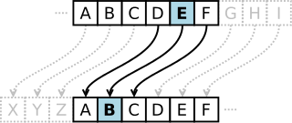

# Practico de Funciones.

## Scopes

### Tipos de Scopes

El `scope` es la capacidad de acceder a variables desde alguna parte del programa durante su ejecución. En otras palabras, determina la visibilidad de las variables en cada área del código.

JavaScript a partir de ES6 cuenta con dos tipos de scope:

- Lexical Scope o Function Scope.
- Block Scope.

#### Lexical Scope

Los `lexical scopes` son creados junto con cada aplicación, y por mucho tiempo, fuerón la única forma de crear un `scope`.

```javascript
function foo() {
    var bar;
}
```

La variable `bar` solo puede ser accedida dentro de la función `foo`, y no puede ser accedida por níngún otra parte del programa.

#### Block Scope

ES6 introduce dos nuevos operadores al lenguaje para instanciar variables: `let` y `conf`, que se suman al operador actual `var`. Dependiendo de que operador utilice será como se definirá la variable.

Una variable declarada con el operador `var` asignara las variables al `scope` de la función indicada, o al `scope` global, independientemente de donde haya sido declarada.

```javascript
function foo(arg) {
    var bar = 1;

    if (arg === true) {
        var baz = 2;
    }
    
    console.log(bar);
    // >>> 1
    console.log(baz);
    // >>> 2
}
```

En el ejemplo anterior ambas llamadas a `console.log` imprimiran el valor con las cuales las variables fueron declaradas. Esto es porque ambas variables están asociadas al `scope` de la función `foo`.

Si en vez de haber utilizado el operador `let` en vez de `var` para definir las variables el comportamiento hubiera sido distinto:

```javascript
function foo(arg) {
    let bar = 1;

    if (arg === true) {
        let baz = 2;
    }
    
    console.log(bar);
    // >>> 1
    console.log(baz);
    // >>> undefined
}
```

Ahora, la segunda llamada a `console.log` retorna `undefined` porque no existe nínguna variable llamada `baz` en el `scope` de la función `foo`. La variable `baz` solo existe en el `block scope` del enunciado `if`. En JavaScript un `block scope` es definido utilizando los corchetes, más uno o más enunciados dentro de ellos.

**OBS: La única diferencia entre `let` y `const` es que este último no puede ser declarado como `undefined`, y luego de declarado no se puede mutar su valor.**

#### Ejercicio

1. Crear una función `foo` que contenga una variable en el `lexical scope` de la función que se llame `bar`. 

<details>
<summary>Solución</summary>

```javascript
function foo() {
  var bar;
}
```

</details>

2. Crear una función `foos` que contenga un bloque `if` y un bloque `for`, que contengan variables que solo puedan ser accedidas desde su correspondientes `block scopes`.

<details>
<summary>Solución</summary>
```javascript
function foos() {
    if (true) {
        let bar;
    }

    for (let i = 0; i < 5; i++) {
        const j = 1;
    }
}
```
</details>

### Scope Nesting

Nuevos `scopes` pueden ser creados dentro de un scope, ya sea creando una nueva función, o un nuevo bloque.

```javascript
function foo() {
    var foos;
    function bar() {
        var bars;
    }
}
```

En el ejemplo, la variable `bars` esta definida en el `scope` de `bar` y solo puede ser accedida dentro de dicha función. Por el contrario, la variable `foos` que pertenece al `scope` de `foo` puede ser accedida tanto dentro de `bar` como dentro de `foo`;

Al ir agregando más funciones y bloques, los `scopes` creados comienzan a tomar una estructura tipo árbol.

```javascript
function foo() {
    function bar() {}
    function baz() {
        function() {}
    }
}
/**
      foo()
       |
      / \
     /   \
    /     \
   ↓       ↓
  bar()   baz()
           |
           ↓
         [anonymous]()
 */
```

Podemos utilizar estas estructuras para verificar el nivel de acceso a los que tienen accesos los enunciados referidos a cada scope.

```javascript
/*
      foo()
       ↑
        \
         \
          \
          baz()
           ↑
           |
         [anonymous]()
 */
```

A eso se lo conoce como `scope chain`.

#### Ejericio

Construya una función que declare los siguientes scopes.

```javascript
/**      
      foo()
       /|\
      / | \
     /  |  \
    /   |   \
   /    |    \
 foos  bar   soof
       / \
      /   \
     /     \
   bars    srab
*/
```

<details>
<summary>Solución</summary>
```javascript
function foo() {
    function foos() {}
    function soof() {}
    function bar() {
        function bars() {}
        function srab() {}
    }
}
```
</details>

## Closures

`Closure` es el nombre que se le da a la propiedad de las funciónes de mantener acceso a variables definidas en el `scope` creado al momento de crear la función.

Supongamos que tenemos el siguiente `scope chain`, en donde dentro de la función `foo` se definio la variable `foos`.

```javascript
/*
  foo()
 var foos
    ↑
    |
   baz()
console.log(foos)
    ↑
    ⋮
 */
```

Siguiendo esta cadena es evidente que podemos acceder a `foos` dentro de `baz`. Es usual decir que `baz` "closes over" (se cierra alrededor) de `foos`. Lo que no es evidente es que este acceso se mantiene, aunque la función `baz` no sea invocada inmediatamente. Veamoslo en un ejemplo para que quede más claro.

```javascript
function foo() {
    var foos = 'Dentro del scope de foo.';
    
    function() baz{
        console.log(foos);
    }

    baz();
    // >>> 'Dentro del scope de foo.'
    
    return baz;
}

var bar = foo();
bar();
// >>> 'Dentro del scope de foo.'
```

No importa donde ni cuando invoquemos la función `baz`, la misma continuará teniendo acceso al `scope` en el que fue definida.

### Ejercicio

Cree una función llamada `createCounterFrom` que tome un valor inicial, y devuelva una función que devolverá un número cuando sea llamada, que se incrementará tras cada incovación.

```javascript
var counter = createCounterFrom(3);

counter();
// >>> 3
counter();
// >>> 4
counter();
// >>> 5
```

<details>
<summary>Solución</summary>
```javascript
function createCounterFrom(initial) {
    return function() {
        return initial++;
    };
}
```
</details>

## Problemas

1. Cifrado de Cesar

Julio Cesar utilizaba un metodo muy sencillo para cifrar sus mensajes, cambiaba cada letra de su mensaje por otra ubicada cuatro veces atras en el abecedario. La siguiente imagen muestra un ejemplo de su funcionamiento.



Una leve modificación (no más segura) de este sistema es colocar un espacio en la última posición, el cual también se asocia al cuarto cáracter anterior del abecedario. Para un offset de 4, su valor será `w`.

*a.* Implemente una función llamada `createCesarCipherFrom` que tome un "offset" para defasar el abecedario, que devuelva un objeto que contenga dos llaves: `cipher` y `decipher`. La llave `cipher` contendrá una función que tome un string de texto y devuelva su versión codificada. Por el contrario, dentro de la llave `decipher` deberá existir una función que tome un string cifrado, y recupere el mensaje. El abecedario utilizado deberá contener la `ñ` y el espacio ` `. Osea, algo así: `"abcdefghijklmnñopqrstuvwxyz "`.

**OBS 1: En caso de que el string ingresado contuviera carácteres que no se encuentran dentro del abecedario, deberá colocar un `*` en el string retornado.**

**OBS 2: Nínguna de las funciones deberá fallar si se le entregán strings con carácteres que no existan en el abecedario utilizado.**

**OBS 3: La clave utilizada para cifrar el mensaje deberá poder ser accedida solo por las funciones `cipher` y `decipher`.**

```javascript
var message = 'conatel iot';
var cesar = createCesarCipherFrom(7);

var code = cesar.cipher(message);
console.log(code);
// >>> xjhvñzfucjñ
console.log(cesar.decipher(code) === message);
// >>> true

message = 'Conatel S.A. IoT';
var cipheredMessage = cesar.cipher(message);
console.log(cipheredMessage);
// >>> *jhvñzfu****u*j*
console.log(cesar.decipher(cipheredMessage));
// >>> *onatel **** *o*
```

*b.* Modifique la función para que en vez de recibir únicamente el valor de offset como argumento, reciba un objeto con las siguientes propiedades:

- `offset`: Corresponde al valor de offset del abecedario para cifrar el mensaje.
- `alphabet`: Corresponde al alfabeto a utilizar, el será de tipo string. Por ejemplo: `"abcdefghijklmnñopqrstuvwxyz "`.

<details>
<summary>Solución</summary>
```javascript
/**
 * Crea un objeto que permite cifar y decifrar mensajes de texto utilizando
 * el "cifrado de cesar", con la capacidad de configurarle el offset del
 * cifrado.
 * @param  {object} options Objeto de opciones.
 *  @param  {number} .offset   Offset del algoritmo de cifrado.
 *  @param  {string} .alphabet Alfabeto utilizado por el algoritmo.
 * @return {object}         Objeto de cifrado.
 */
function createCesarCipherFrom(options) {
    // Extraemos los valores del objeto options.
    var offset = options.offset,
        alphabet = options.alphabet;
    // Declaramos las variables en las primeras lineas de la función
    // por convención. 
    var cipherKey, decipherKey;
    // Definimos un valor por defecto de `offset` igual a 4.
    offset || (offset = 4);
    // El valor del offset no puede superar el largo del alfabeto.
    // Giramos en circulo el valor del offset en ese caso.
    if (offset > alphabet.length) {
        offset = offset % alphabet.length;
    }
    /**
     * Función que permite llamar una función sobre cada cáracter de un string,
     * acumulando el valor devuelto en cada iteración.
     * @param  {string}   string  String sobre el cual iterar.
     * @param  {function} fn      Función para correr en cada iteración. Cada
     *                            llamada a la función contará con:
     *                              1.- El valor actualmente acumulado.
     *                              2.- El carácter correspondiente.
     *                              3.- El índice de la iteración.
     * @param  {any}   initial    Valor inicial de la iteración.
     * @return {any}              Resultado de aplicar la función a cada
     *                            cáracter del string.
     */
    function reduce(string, fn, initial) {
        var accumulator = initial;
        for (var i = 0; i < string.length; i++) {
            accumulator = fn(accumulator, string[i], i);
        }
        return accumulator;
    }
    /**
     * Crea un objeto que contiene la clave correspondiente al offset.
     * @param  {number} offset Offset del alfabeto.
     * @return {object}        Clave según offset.
     */
    function createKeyFrom(offset) {
        return reduce(alphabet, function(acc, char, i) {
            var index = i - (offset - 1);
            if (index < 0) {
                index = index + alphabet.length;
            }
            acc[char] = alphabet[index];
            return acc;
        }, {});
    }
    /**
     * Reemplaza cada cáracter de un string por el correspondiente según
     * la clave utilizada.
     * @param  {string} message Mensaje a trascodificar.
     * @param  {object} key     Clave a utilizar.
     * @return {string}         Mensaje transcodificado..
     */
    function transcode(message, key) {
        return reduce(message, function(acc, char, i) {
            var correspondingChar = key[char];
            acc += (correspondingChar !== undefined) ? correspondingChar : '*';
            return acc;
        }, "");
    }
    // Claves para codificar y decodificar.
    cipherKey = createKeyFrom(offset);
    decipherKey = createKeyFrom(alphabet.length - offset + 2);
    // Objeto público para interactuar con las claves.
    return {
        cipher: function(message) {
            return transcode(message, cipherKey);
        },
        decipher: function(message) {
            return transcode(message, decipherKey);
        },
    }
}

// ---

var ALPHABET = "abcdefghijklmnñopqrstuvwxyz "
var cesar = createCesarCipherFrom({
    offset: 7, 
    alphabet: ALPHABET
});
var message = 'conatel iot';
var cipheredMessage = cesar.cipher(message);
console.log(cipheredMessage);
// >>> xjhvñzfucjñ
console.log(message === cesar.decipher(cipheredMessage));
// >>> true

message = 'Conatel S.A. IoT';
var cipheredMessage = cesar.cipher(message);
console.log(cipheredMessage);
// >>> *jhvñzfu****u*j*
console.log(cesar.decipher(cipheredMessage));
// >>> *onatel **** *o*
```
</details>